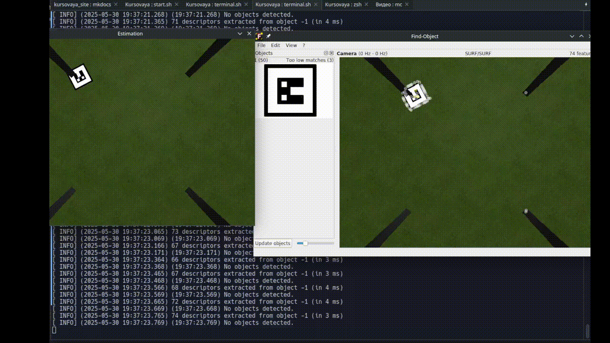
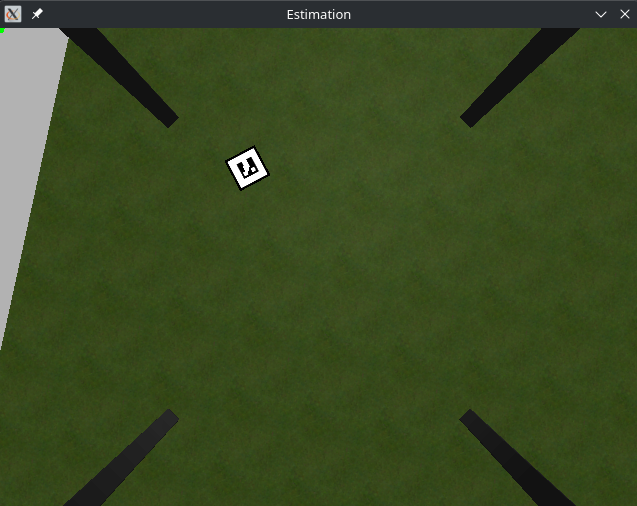
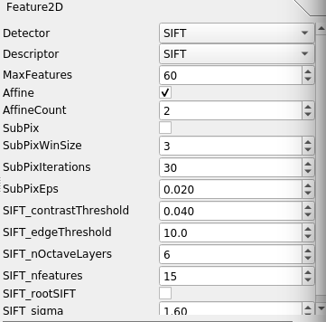
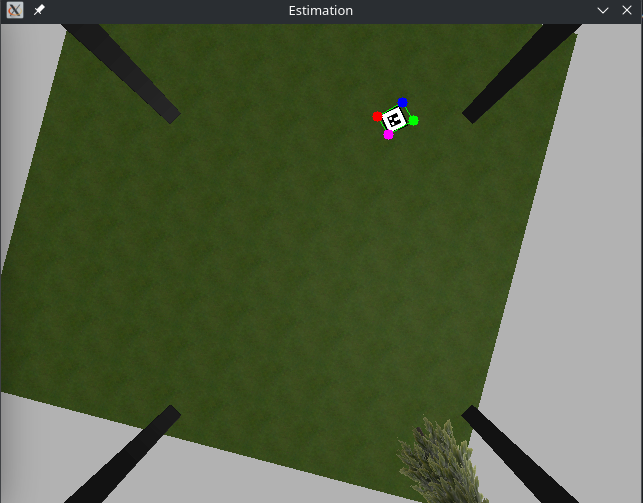
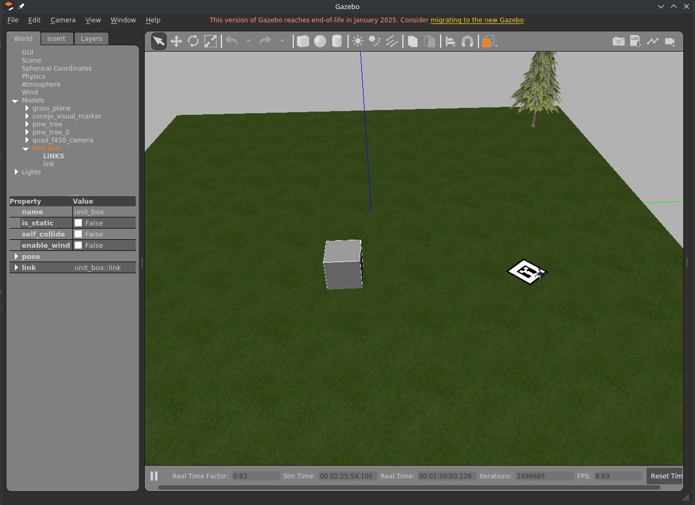
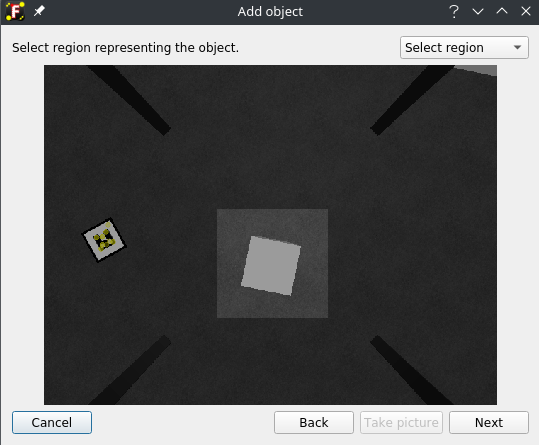
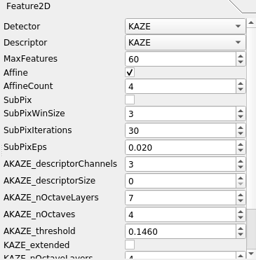
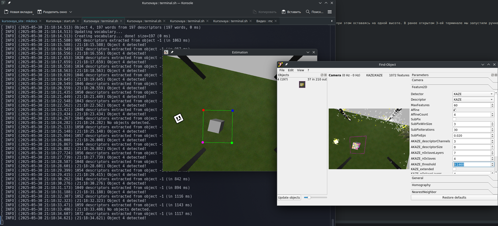

## Постановка эксперимента

### Цель эксперимента
Сравнить эффективность детекторов и дескрипторов локальных признаков SIFT и KAZE для задачи автономной посадки БПЛА на заданный объект (маркер или куб) в симулированной среде Gazebo с использованием ROS и PX4.

### Задачи эксперимента
- Настроить симуляцию БПЛА в Gazebo для тестирования детекторов SIFT и KAZE.
- Реализовать обнаружение маркера и куба с помощью инструмента `Find-Object`, используя SIFT и KAZE.
- Выполнить автономную посадку БПЛА на маркер и куб с использованием ПИД-регулятора.
- Сравнить результаты работы SIFT и KAZE по качеству обнаружения и успешности посадки.


## Детектор и дескриптор SIFT


Для запуска эксперимента необходимо предварительно [запустить проект](./start.md), если этого не было сделано ранее. 

В отдельном терминале запускаем обнаружение маркера, расположенного на поверхности. 

```
roslaunch object_detector simu.launch
```

Откроется окно `Find-Object` со стандартными настройками. 


На gif-изображении видно, как извлекаются признаки маркера, однако система не обнаруживает его как положено. Для этого переместим БПЛА при помощи клавиш `a`, `w`, `d`, `x` поближе к маркеру, но не над ним, при этом оставаясь на одной высоте. В ранее открытом 3-ей терминале мы запустили ручное управление. Переходим в него и перемещаем БПЛА так, чтобы объект был четко виден.



Переходим в окно `Find Object`, активируем параметры `View > Parameters` и подбираем оптимальные параметры обнаружения. Путем экспериментов были выведены следующие параметры:



Результат обнаружения метки с другой позиции и поворотом:



Для посадки БПЛА на маркер необходимо в отдельном терминале запустить узел с ПИД-регулятором. Для этого пишем команду:

```
rosrun drone_controller pid_controller_final
```

Когда БПЛА будет находится над маркером, необходимо перейти в терминал, где активировано ручное управление и нажать на клавишу `5` для посадки.
Результат выполнения приведен на gif-изображении. 

> **Важно**: убедитесь, что у вас отключены узлы `offb_node`, иначе дрон не сможет переместиться к маркеру


## Детектор и дескриптор Kaze
### Описание Kaze

KAZE — это детектор и дескриптор локальных признаков изображения, реализованный в OpenCV как часть библиотеки `features2d`. Он был предложен как альтернатива SIFT и SURF, но с учётом необходимости работы в нелинейных масштабных пространствах. Главное отличие KAZE в том, что он строит масштабно-инвариантное представление не с помощью гауссовой фильтрации, как это делают SIFT или SURF, а с помощью нелинейной диффузии. Это позволяет более точно сохранять структуру изображения (например, контуры), особенно на границах объектов, за счёт подавления размытия этих границ.
Смысл метода в том, что изображение проходит через специальный процесс нелинейной фильтрации (диффузии), в результате которого формируется масштабное пространство. После этого в этом пространстве находятся ключевые точки (например, экстремумы в пространстве масштаба), которые инвариантны к масштабным и частично к аффинным преобразованиям. Для каждой найденной ключевой точки затем строится дескриптор — числовой вектор, описывающий локальное окружение точки, пригодный для сопоставления.
Для ускорения существует вариант под названием AKAZE (Accelerated KAZE), который использует нелинейную диффузию на дискретной сетке (с применением октавы), что позволяет получить сопоставимое качество, но с заметно более высокой скоростью.

### Эксперимент с Kaze 
Добавим на сцену в Gazebo куб и размещаем в случайном положении.


Зайдем в окно `Find-Object` и удалим все текущие объекты для обнаружения (`Edit > Remove all objects`). Добавим новый объект (`Edit > Add object from scene...`). Важно, чтобы добавленный на сцену объект был виден через это окно. Выделяем куб и нажимаем на `Take Picture`. Добавляем куб с нескольких ракурсов, чтобы детектор мог точно определить положение нужно нам объекта.



Выставим такие параметры: 



Результатом будет:



Теперь вызовем узел посадки БПЛА на этот куб


## Выводы

В рамках эксперимента были протестированы детекторы и дескрипторы локальных признаков SIFT и KAZE для задачи автономной посадки БПЛА на заданные объекты (маркер и куб) в симулированной среде Gazebo с использованием ROS и PX4. 

- SIFT показал высокую точность и стабильность при обнаружении маркера, что обеспечило успешную посадку БПЛА в большинстве случаев. Настройка параметров в Find-Object позволила эффективно адаптировать детектор к условиям сцены.
- KAZE продемонстрировал менее надежные результаты: детектор часто путал куб с маркером, что снижало точность обнаружения. Однако при правильной настройке параметров и добавлении объекта с нескольких ракурсов посадка на куб была достигнута.

Полученные результаты подтверждают превосходство SIFT для задач точного обнаружения объектов в условиях симуляции, тогда как KAZE требует более тщательной настройки и может быть менее устойчивым к ошибкам распознавания. 
