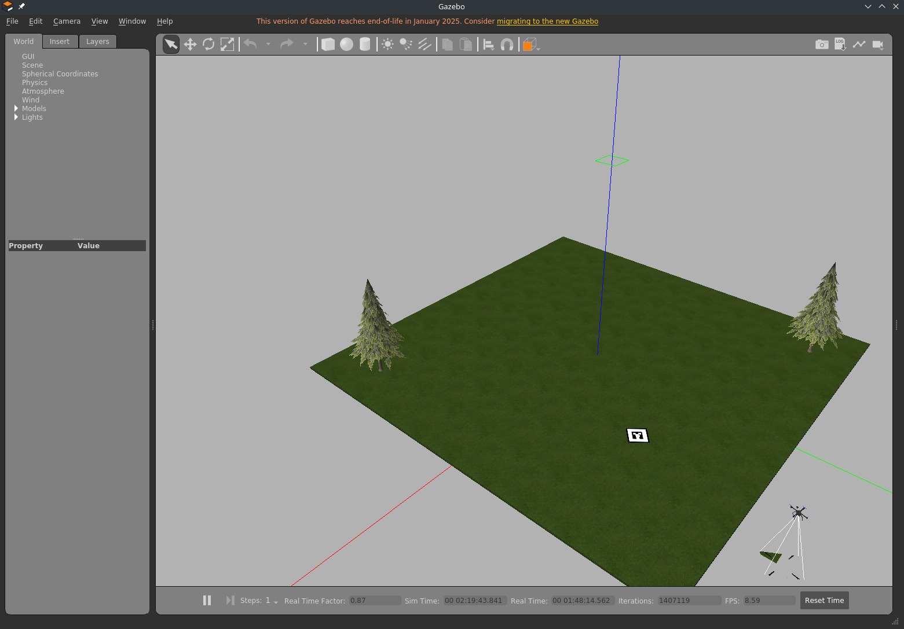

## Запуск проекта

Данный проект запускался из под Docker-контейнера. Для запуска проекта необходимо зайти в ранее склонированный [репозиторий](https://github.com/CBOPA/alud) и запустить сам контейнер командой:

```bash
./start.sh
```
После этого вы войдете в контейнер. Переменные среды и `source` прописываать не нужно - это делается автоматически при входе.

Далее для запуска симуляционной среды выполняем команду:
```
roslaunch mavros_off_board mavros_posix_sitl.launch
```

После этого откроется окно с средой симуляции Gazebo и запустятся узлы:

```
NODES
  /
    gazebo (gazebo_ros/gzserver)
    gazebo_gui (gazebo_ros/gzclient)
    image_view (image_view/image_view)
    mavros (mavros/mavros_node)
    sitl (px4/px4)
    vehicle_spawn_cbopa_x870eaglewifi7_62_3647829198282873180 (gazebo_ros/spawn_model)
```



Для взлета БПЛА взлетел нужно запустить узел `offb_node`. Открываем 2-ой терминал и вводим команду для подключения к Docker-контейнеру:
```
./terminal.sh
```
и вводим команду:

```
rosrun mavros_off_board offb_node
```

Результат включение узла для взлета (картинка не зависла, действительно долго запускается узел):


после взлета в другом терминале вводим команду для ручного управления: 
```
rosrun mavros_off_board teleop_node_pos.py
```

и деактивируем узел `offb_node` после взлета (комбинацией клавиш Ctrl + C во 2-ом терминале).


[Запуск эксперимента](./experiment.md)


