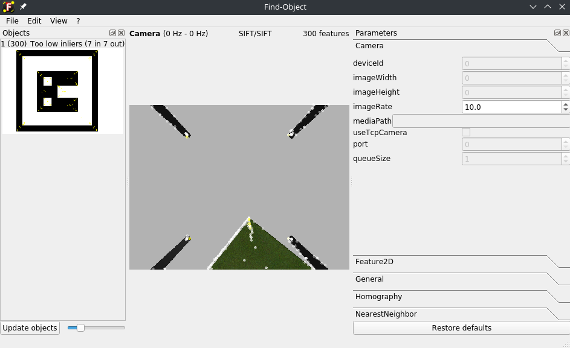

# Блок обнаружения признаков
Данный блок использует пакет `find-object-2d`. В эксперименте используются алгоритмы SIFT и SURF.

### Описание SIFT
SIFT (Scale-Invariant Feature Transform) и SURF (Speeded-Up Robust Features) — это алгоритмы компьютерного зрения, используемые для обнаружения и описания ключевых точек в изображениях, которые устойчивы к изменениям масштаба, поворота и частичным искажениям. Они широко применяются в задачах распознавания объектов, сшивания изображений и 3D-реконструкции. SIFT, разработанный Дэвидом Лоу в 2004 году, решает проблему масштабной инвариантности путем использования разности гауссовых фильтров (Difference of Gaussians, DoG) для аппроксимации лапласиана гауссиана, что позволяет находить ключевые точки, устойчивые к изменениям масштаба. Процесс SIFT включает четыре основных этапа: определение экстремальных точек в пространстве масштабов, уточнение положения ключевых точек, назначение ориентации на основе локальных градиентов изображения и создание дескриптора — 128-мерного вектора, описывающего окрестность ключевой точки на основе гистограмм градиентов. Алгоритм обеспечивает высокую точность, но требует значительных вычислительных ресурсов, что делает SIFT медленным для приложений реального времени.

### Описание SURF

SURF, предложенный в 2006 году как улучшение SIFT, направлен на ускорение процесса при сохранении надежности. Вместо DoG SURF использует боксовые фильтры для аппроксимации гауссовых производных, что позволяет выполнять вычисления быстрее благодаря интегральным изображениям. SURF вычисляет Haar-вейвлет отклики в окрестности ключевой точки для определения ориентации и создает 64-мерный дескриптор (или 128-мерный в расширенной версии), основанный на суммах вейвлет-откликов в ячейках сетки 4x4 вокруг ключевой точки. SURF быстрее, чем SIFT, при сохранении устойчивости к изменениям масштаба и поворота, однако он менее точен.

### Описание пакета

`find_object_2d` предоставляет гибкость в настройке параметров, таких как выбор детектора (SIFT, SURF, ORB и др.), настройка гомографии для фильтрации выбросов с помощью RANSAC и выбор стратегии поиска ближайших соседей (например, FLANN или BruteForce). Пакет также поддерживает функции сохранения и загрузки сессий, drag-and-drop для добавления объектов и TCP-интерфейс для передачи данных об обнаруженных объектах.

Пример интерфейса запущенного пакета

