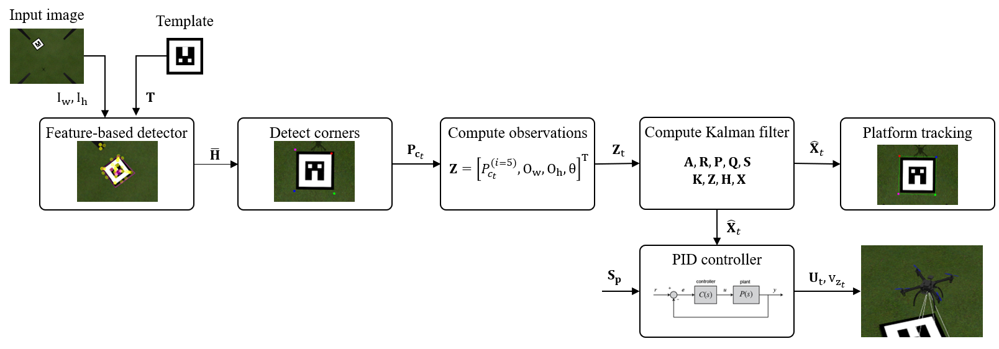

## Принцип работы системы

Система автономной посадки разрабатывалась и тестировалась в симуляторе Gazebo и на модифицированном DJI F450 с бортовым компьютером. Рабочий процесс системы в моделируемой среде выглядит следующим образом:

- Система запускается в Gazebo и взаимодействует с микропрограммой PX4. Затем транспортное средство отрывается от земли и перемещается в положение, откуда видна посадочная платформа. 
- Модуль обнаружения начинает работать, и с помощью функционального детектора и фильтра Калмана посадочная площадка начинает отслеживается. 
- Как только будет произведена первая оценка посадочной платформы, диспетчер посадки начнет работать и переместит БПЛА к центру платформы, но снижаться не будет. 

Ниже представлена упрощенная схема работы системы

На схеме представлена система визуального слежения и управления движением платформы, основанная на обработке изображений, фильтре Калмана и ПИД-регуляторе. Всё начинается с входного изображения, поступающего с камеры, где находится наблюдаемый объект — визуальный маркер. Параллельно системе подаётся шаблон маркера, который используется для сопоставления и распознавания объекта на изображении.

Первым этапом является работа детектора на основе признаков (`feature-based detector`), который с использованием шаблона обнаруживает положение маркера на изображении. На этом этапе определяется матрица гомографии \(\overline{H}\), отражающая преобразование шаблона к текущему изображению, чтобы локализовать положение и ориентацию маркера в кадре.

Далее происходит извлечение углов маркера. Используя гомографию, система находит координаты вершин (углов) маркера — эти точки обозначены как \(P_{ct}\). На следующем этапе на основе этих координат формируется вектор наблюдений \(\mathbf{z}_t\), который содержит не только координаты центральной точки маркера \( p^{(i=5)}_{ct}\), но и физические размеры объекта в пикселях (ширина \(O_w\), высота \(O_h$\)) и угол его ориентации \(\theta\).

Полученный вектор наблюдений подаётся на вход фильтра Калмана, который использует системные матрицы (в том числе \(\mathbf{A}, \mathbf{P}, \mathbf{Q}, \mathbf{R}, \mathbf{K}, \mathbf{H}\)) для оценки текущего состояния платформы. На выходе фильтра Калмана формируется сглаженная и предсказанная оценка состояния \(\hat{\mathbf{x}}_t\), содержащая информацию о положении, размере и ориентации маркера с учётом предсказаний и шумов.

Оценённое состояние поступает на два блока. Первый из них — это визуализация слежения за платформой, где обновляется положение маркера на изображении. Второй блок — это ПИД-регулятор, который сравнивает текущее состояние с желаемым положением цели \(\mathbf{S}_p\) и на основе этой ошибки формирует управляющее воздействие. Результатом работы ПИД-регулятора являются управляющие сигналы \(\mathbf{U}_t\) и вертикальная скорость \(\mathbf{v}_{z_t}\), которые подаются на систему управления БПЛА.

Подробнее про [фильтр Калмана](./kalman.md), [блок обнаружения признаков](./feature_detector.md)

